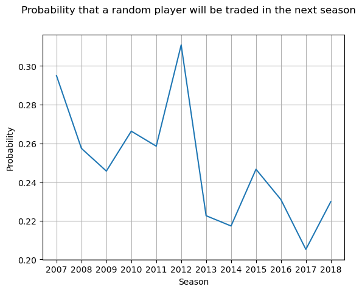

# NI-MLP semestral work report
- student: `Matej Murín (username: murinmat)`
- chosen dataset: [NHL player statistics](https://courses.fit.cvut.cz/NI-MLP/files/nhl-player-data.zip)
---
TABLE OF CONTENTS:
- [NI-MLP semestral work report](#ni-mlp-semestral-work-report)
  - [1. Business understanding](#1-business-understanding)
  - [2 Data quality checking](#2-data-quality-checking)
    - [2.1 Fixin NaN values](#21-fixin-nan-values)
    - [2.2 Logical inconsistencies](#22-logical-inconsistencies)
    - [2.3 Unique player identification](#23-unique-player-identification)
  - [3. Data undestranding / exploratory analysis](#3-data-undestranding--exploratory-analysis)
    - [3.1 The ``goals`` variable](#31-the-goals-variable)
    - [3.2 Player being ``traded`` in the next season](#32-player-being-traded-in-the-next-season)
    - [3.3 Number of ``Hart Trophy`` votes in the next season](#33-number-of-hart-trophy-votes-in-the-next-season)
    - [3.4 Predictor variables](#34-predictor-variables)
  - [4. Interim data analysis conclusions](#4-interim-data-analysis-conclusions)

---
This work will follow the CRISP-DM methodology, so the individual steps had been partitioned as such.


[Source: Wikipedia](https://en.wikipedia.org/wiki/Cross-industry_standard_process_for_data_mining)

## 1. Business understanding

As per the oficial [description](https://courses.fit.cvut.cz/NI-MLP/files/datasets-assignments-instructions.pdf), this semestral work concerns itself with data containing:
```
Individual statistics of the NHL players in seasons 2004 to 2018 and the list of teams.
Description (in Czech) of columns is in the extra file README.txt.
```

The data itself is in a `csv` format consisting of various variables such as:
- player name
- age
- position
- team the player plays for in a given season
- number of goals scored in a given season
- average time on ice in a given season
- etc.

For the purpose of this work, we will focus on the following variables as the ones we are trying to describe and later on predict, in one way or another:
- number of **goals scored** in the next season
    - this is the most interesting variable for arguably the most people
- the probability of a player being **traded** in the next season
    - this could be interesting to fans and management alike, knowing what players are likely to be open for trades or not
- number of [**Hart Trophy**](https://en.wikipedia.org/wiki/Hart_Memorial_Trophy) votes in the next season
    - this might help determining how valuable a player will be in the next season

All the exploratory analysis that will be done should and will always keep in mind the variables we had deemed to be "interesting" during business understanding.

## 2 Data quality checking

### 2.1 Fixin NaN values

If we look at missing values in the dataset, we find the following:

| Row name | number of NaNs |
| --------- | -------------- |
| shoot_success_rate | 124 |
| num_blocked_shots | 1 |
| faceoff_wins | 1 |
| faceoff_losses | 1 |
| faceoff_success_rate | 311 |

We see that there is only one record missing for **num_blocked_shots**, **faceoff_wins** and **faceoff_losses**. For all of those, they appear in one record only, a player name **Brian Lashoff**. He played a total of one game in the NHL in that specific season. Let's therefore simply remove that one record from the dataset completely.

Now let's deal with the missing **shoot_success_rate** values. These missing values are not necessarily missing, only not defined if the player actually had no shots on goal in that season. After having a look at the data, we see that this is indeed the case. However, there are also other records where the player has 0 shots on goal in that season and at the same time, the shoot success rate value is also 0, but it should be a NaN. Let's, therefore, change all those values to NaNs as well. After doing this, we find that there are **273** records like this, instead of the original **124**.

After doing the similar for **faceoff_success_rate**, where everyone that had no faceoff wins and no faceoff losses should have this value undefined. After doing this, we find that there is actually **5865** records that should have this value undefined, but instead it is set to 0. We set it to NaN again.

### 2.2 Logical inconsistencies

After looking at the min/max values of each column, we can find some apparent problems. First, there is a record with a player being of the **age of 0 years old**. There is only one record like this, and we cannot infer his age from other seasons, since this one record contains the only season that this player appeared in. We therefore remove this record from the dataset entirely.

There appear to also be some players with average time on ice being 0, even though the total time on ice is not 0. We therefore recalculate this value as:

**$average\ time\ on\ ice = \frac{total\ time\ on\ ice}{number\ of\ games\ player}$**.

### 2.3 Unique player identification

Now let's have a look at player identification. If we aggregate the data by **player name** and check how many unique values they have for **nick** column, we see that there are 9 records like this:

|player | number of unique nicks |
| ----- | ---------------------- |
| Alexandre Picard |	2 |
| Colin White	| 2 |
| Erik Gustafsson |	2 |
| Mike Brown |	2 |
| Mike Green |	2 |
| Mikko Lehtonen |	2 |
| Petr Sykora |	2 |
| Sean Collins |	2 |
| Sebastian Aho |	2 |

After having observing those manually, checking the values of their position, age and season, the conclusion becomes that the identifying column for a player is the column **nick**.

On the other hand, if we observe values where there is one **nick** value for multiple **player** values, we can see that those simply have different "versions" of their first names, even Cristoval "Boo" Nieves. Specifically, those are:

| player nick | unique names | names |
| ------- | ---------- | --------- |
| didomch01 |	2	| [Chris Didomenico, Christopher Didomenico] |
| grzelma01 |	2	| [Matt Grzelcyk, Matthew Grzelcyk] |
| maroopa01 |	2	| [Pat Maroon, Patrick Maroon] |
| mathemi01 |	2	| [Michael Matheson, Mike Matheson] |
| nievecr01 |	2	| [Boo Nieves, Cristoval Nieves] |
| petroal01 |	2	| [Alex Petrovic, Alexander Petrovic] |

We are therefore positive that the identifying value is contained within the **nick** column.

## 3. Data undestranding / exploratory analysis

This part focuses on improved undestanding of the variables we deemed interresing from the bussiness standpoint in [part 1](#1-business-understanding).

### 3.1 The ``goals`` variable

Let's first have a look at the distribution of goals by a player in a season. Since there are multiple records per player, as the dataset contains data from 2004 to 2018, we take the mean of the goals as the variable to plot.


We can see that it is somehow exponentially distributed, as was expected. If we think about it, most teams have a few players that score the majority of all the goals. Those will be the players that, for example:
- are generally *better* than other players
- are on a **power play** lineup
- etc.

Let's now have a look at what variables correlate the most with the number of goals scored. We assume there will be some obvious ones, such as **number of powerplay goals**, but others that might not be so obvious. For this, we will take into account only the numerical variables. For now, this means omitting **player name**, **player team** and **position**. To also not show all variables, we will show only the ones where the correlation coefficient is **above 0.5**, either positive or negative.


Here we see that there are is some expected correlation with other statistics, such as total number of points or number of 5-on-5 goals. However, there are some not so apparent ones from which we can make some assumptions:
- the more time on ice a player is given, the more likely he is to score a goal
- the more games a player plays, the more likely he is to score a goal
- a player who scores a lot is also likely to have more assists

We can therefore assume that when modeling the prediction for the number of goals in the next season, we these other variables, or features, will be the most helpful.

### 3.2 Player being ``traded`` in the next season

Let's now observe what players had been traded in the following season. Since there is no such variable in the dataset, we have to create it. Luckily it's very simple. We will just have a look at what team a player is in the given season, if he has a record in the dataset in the next season, and if the teams are the same or not.


From the above distribution, we can see that there is roughly a **30%** chance that a *randomly picked* player will be traded in the next season. 
Let's also see if there is any trend of players being traded in a specific season we have in the dataset.



From this graph we can see that there seems to be somewhat decreasing trend, with less players being traded in the recent seasons than in the previous ones. We should not, however, jump to this conclusion, since there aren't enough seasons in the datasets to be able to obtain fair statistics to assert an apparent trend.

Let's now observe if there are any indications that a player will be traded. For this, we will use a simple **logistic regression** model and have a look at the coefficients. This is because for a player being traded, we can assume that it more complex than just scoring goals, and it can be a combination of multiple factors deciding whether they will be traded or not. We will only take into account the data points where we know if the player had been traded in the next season or not, omiting the data where it is unknown. This leaves us with roughly **70%** of the data, a little over **8500** records. 


Unfortunately, we are not able to make many conclusions form this. The ones we can assume are:
- a player who plays on **penalty kill** units, and even is able to score on them, is less likely to be traded
- the older the player, the more likely they are to be traded
- to some extent, a player who scores a lot of gamewinning goals is less likely to be traded

### 3.3 Number of ``Hart Trophy`` votes in the next season
Let's first see what this trophy even is awarded for. 

As per [wikipedia](https://en.wikipedia.org/wiki/Hart_Memorial_Trophy), it says:
```
The Hart Memorial Trophy, originally known as the Hart Trophy, is an annual award for the most valuable player in the National Hockey League (NHL), voted by the members of the Professional Hockey Writers' Association.
```

We see that it is a trophy awarded to the most valuable player, or MVP.
Let's therefore first observe the distribution of those votes. We expect the majority of the votes being awarded to a minority of the players, something like the 80-20 rule.
Because of this, let's not use histogram plot, but rather a sorted scatter plot.


We see that that is indeed the case. Even more, it seems that only very few players get the majority of all the votes. This indicates towards a theory that every season, there are a few players that really stand out compared to others.

 Now let's see what could be the variables from previous season that correlate the most with the number of votes in the current season. For this we will create such a column in the dataset, since it only contains the number of votes acquired in the current season.


We see that the most positively influential variables are:
- number of **Hart Trophy** votes in the current season
- number of **points** acquired (and by proxy number of goals and assists)

Conversely on the negative side, we see that:
- as players **age** increases, they are less likely to win this award
- whether a player ends up being **traded** next season also has a negative impact; we can assume that this is because, usually, most valuable players don't end up being traded


### 3.4 Predictor variables

Let's have a look at the predictor variables and their distribution. However, let's only have a look at the more interesting ones. For each variable we will have a look at, we will plot:

- histogram of the data
- histogram of $log_2$(data - min(data) + 1)
- boxplot

The transformation in the $log_2$ function will ensure that values of 0 or lower won't cause issues, while at the same time, we will be able to see the log-distribution.

The nicest predictor there could be are the **plus/minus** and **time on ice**. If we look at the data, we see that plus/minues sits nicely around 0, and average time on ice sits around 15 minutes. Very similarily distributed is the **faceoff success rate**, if we omit players with 0% or 100% success rate. This can be due to the fact that there are some players who were just on 1 face-off during the entire season and ended up winning, or losing it.


**Age** is also quite normally distributed, but skewed a little towards young players, which is also to be expected.


Now for all of **goals**, **assists** and **total points**, we can find that they all seems exponentially or log-normally distributed, which is also to be expected. We only include the graph of points, but both goals and assists are very similar.


One predictor that is very nicely log-normally distributed are **penalty minutes** and **shoot success rate**. We can see that there are quite a few playes that had no penalty minutes, but from thos who did have at least some, they do follow some sort of log-normal distribution. The same can be said for the shoot success rate, not counting in players who scored no goals, that is.


The last predictor we will have a closer look at is the **number of shorthanded goals** variable. We can see that the vast majority of players had no shorthanded goals, but there are a few that are in fact able to score, even shorthanded. If we had plotted the number of shorthanded assists, we would see the same pattern.


If we look at the distribution of the **position** variable, we might find that there are some players who have had played mroe than just one position within a season.


It is interresting to see that there are some who have position as **LW/RW**, and some who just **W**, since these should technically be the same thing. We will need to fix this when using the data in a model.
## 4. Interim data analysis conclusions

Let's summarize what had been done so far. In [Part 1: the Business Understanding](#1-business-understanding), we had introduced the dataset. We had not described every single column in the `csv` file containing the data, as that would be unnecessary and anyone interested can do so themselves. Furthermore, we had defined the main goals of this work. That is, understand the *crucial* variables that we are interested in and described what they mean and why they are interresting. Let's mention them once again, as a refresher. Those variables are:
  
- number of **goals scored** in the next season
- probability of a player **being traded** in the next season
- number of *votes* for the [**Hart Trophy**](https://en.wikipedia.org/wiki/Hart_Memorial_Trophy) received in the next season

Consequently in [part 2](#2-data-undestranding--exploratory-analysis), we had performed some initial exploratory analysis of the data in the dataset related to those variables. Let's again recap what we had found out about those variables.

For the [**goals**](#21-the-goals-variable) variable, we found out that it has some sort of exponential distribution among players, where a minority of the player base scores the most goals. We had also explored the correlation between number of goals scored and other variables. Some of the more interresting finds were that it pretty strongly correlates with ``time on ice`` and ``games player``, which, if we think about it, makes sense. To increase chances to score, more ice time deffinitely helps. On the other hands, if you score a lot of goals, chances are you will be provided with more ice time compared to other players.

For the [**traded in next season**](#22-player-being-traded-in-the-next-season) variable, we first had a look at the proportion of players being traded. We saw that there is roughly a ``30%`` chance that a randomly picked player in a random season will be traded. Furthermore, we had aggregated the chance of being traded with the season a player ended up traded in. We had observed a somewhat downward trend, with less players being trade in the recent seasons compared to the older ones. We had then done a logistic regression on other variables to see any pointers to a player being traded in the next season based on current season statistics. For this, we saw that increasing **age** points the most towards a chance of being traded. Conversely, the number of **shorthanded goals** as well as **shorthanded assists** seems to decrease the chance of a player being traded.

Lastly, for the [**number of Hart Trophy votes**](#23-number-of-hart-trophy-votes-in-the-next-season) in the next season, we first observed the distribution of votes among seasons. Here we saw something interesting, but something that also makes sense when thought about. A very small minority of players ends up receiving the vast majority of votes. This seems to indicate that there are a few players each season that stand out and end up getting voted for in the end. As in terms of correlation with other variables, the mostly correlated ones were the **nubmer of votes** in previous season, as well as number of **points** acquired. By proxy, this also means number of **goals** and number of **assists**. Interestingly, if a player ends up being **traded** in the next season, they are likely to receive fewer amount of votes. This seems to point towards a theory that the players that end up being traded receive less votes, meaning they are probably the players that teams are not happy with, which could mean that they don't perform as is expected of them.
