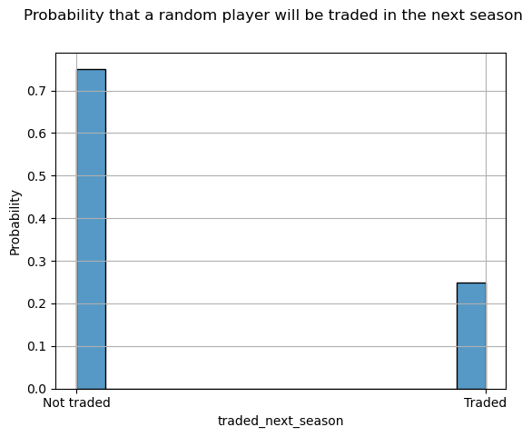

# NI-MLP semestral work report
- student: `Matej Murín (username: murinmat)`
- chosen dataset: `NHL player statistics`
---
TABLE OF CONTENTS:
- [NI-MLP semestral work report](#ni-mlp-semestral-work-report)
  - [1. Business understanding](#1-business-understanding)
  - [2. Exploratory analysis](#2-exploratory-analysis)
    - [2.1 The ``goals`` variable](#21-the-goals-variable)
    - [2.2 Player being **traded** in the next season](#22-player-being-traded-in-the-next-season)
  - [3. Interim data analysis conclusions](#3-interim-data-analysis-conclusions)

---
This work will follow the CRISP-DM methodology, so the individual steps had been partitioned as such.


## 1. Business understanding

As per the oficial [description](https://courses.fit.cvut.cz/NI-MLP/files/datasets-assignments-instructions.pdf), this semestral work concerns itself with data containing:
```
Individual statistics of the NHL players in seasons 2004 to 2018 and the list of teams.
Description (in Czech) of columns is in the extra file README.txt.
```

The data itself is in a `csv` format consisting of various variables such as:
- player name
- age
- position
- team the player plays for in a given season
- number of goals scored in a given season
- average time on ice in a given season
- etc.

For the purpose of this work, we will focus on the following variables as the ones we are trying to describe and later on predict, in one way or another:
- number of **goals scored** in the next season
    - this is the most interesting variable for arguably the most people
- the probability of a player being **traded** in the next season
    - this could be interesting to fans and management alike, knowing what players are likely to be open for trades or not
- the **face-off** win ratio in the next season
    - this attribute is particularly important in crucial situations during a game
- number of **Hart Trophy** votes in the next season
    - this might help determining how valuable a player will be in the next season

## 2. Exploratory analysis

All the exploratory analysis that will be done should and will always keep in mind the variables we had deemed to be "interesting" during business understanding.

### 2.1 The ``goals`` variable

Let's first have a look at the distribution of goals by a player in a season. Since there are multiple records per player, as the dataset contains data from 2004 to 2018, we take the mean of the goals as the variable to plot.


We can see that it is somehow exponentially distributed, as was expected. If we think about it, most teams have a few players that score the majority of all the goals. Those will be the players that, for example:
- are generally *better* than other players
- are on a **power play** lineup
- etc.

Let's now have a look at what variables correlate the most with the number of goals scored. We assume there will be some obvious ones, such as **number of powerplay goals**, but others that might not be so obvious. For this, we will take into account only the numerical variables. For now, this means omitting **player name**, **player team** and **position**. To also not show all variables, we will show only the ones where the correlation coefficient is **above 0.5**, either positive or negative.


Here we see that there are is some expected correlation with other statistics, such as total number of points or number of 5-on-5 goals. However, there are some not so apparent ones from which we can make some assumptions:
- the more time on ice a player is given, the more likely he is to score a goal
- the more games a player plays, the more likely he is to score a goal
- a player who scores a lot is also likely to have more assists

We can therefore assume that when modeling the prediction for the number of goals in the next season, we these other variables, or features, will be the most helpful.

### 2.2 Player being **traded** in the next season

Let's now observe what players had been traded in the following season. Since there is no such variable in the dataset, we have to create it. Luckily it's very simple. We will just have a look at what team a player is in the given season, if he has a record in the dataset in the next season, and if the teams are the same or not.



From the above distribution, we can see that there is roughly a **30%** chance that a *randomly picked* player will be traded in the next season. Let's now observe if there are any indications that they will be traded. For this, we will use a simple **logistic regression** model and have a look at the coefficients. This is because for a player being traded, we can assume that it more complex than just scoring goals, and it can be a combination of multiple factors deciding whether they will be traded or not. We will only take into account the data points where we know if the player had been traded in the next season or not, omiting the data where it is unknown. This leaves us with roughly **70%** of the data, a little over **8500** records. 


Unfortunately, we are not able to make many conclusions form this. The ones we can assume are:
- a player who plays on **penalty kill** units, and even is able to score on them, is less likely to be traded
- the older the player, the more likely they are to be traded

## 3. Interim data analysis conclusions
Some text