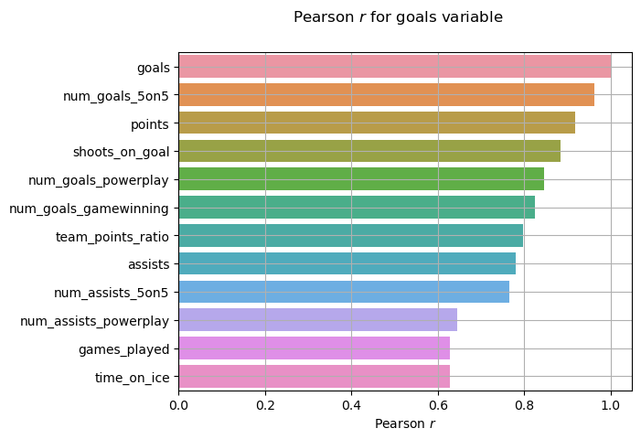

# NI-MLP semestral work
- student: `Matej Murín (username: murinmat)`
- chosen dataset: `NHL player statistics`

It will follow the CRISP-DM methodology, so the individual steps can be partitioned as such.


První verze (částečná, nejpozději 13. 11.): formulace řešeného problému, exploratorní analýza dat potřebných k jeho řešení, porozumění datům, průběžný závěr z explorací

## 1. Business understanding

As per the oficial [description](https://courses.fit.cvut.cz/NI-MLP/files/datasets-assignments-instructions.pdf), this semestral work concerns itself with data containing:
```
Individual statistics of the NHL players in seasons 2004 to 2018 and the list of teams.
Description (in Czech) of columns is in the extra file README.txt.
```

The data itself is in a `csv` format consisting of various variables such as:
- player name
- age
- position
- team the player plays for in a given season
- number of goals scored in a given season
- average time on ice in a given season
- etc.

For the purpose of this work, we will focus on the following variables as the ones we are trying to describe and later on predict, in one way or another:
- number of **goals scored** in the next season
    - this is the most interesting variable for arguably the most people
- the **face-off** win ratio in the next season
    - this attribute is particularly important in crucial situations during a game
- the probability of a player being **traded** in the next season
    - this could be interesting to fans and management alike, knowing what players are likely to be open for trades or not
- number of **Hart Trophy** votes in the next season
    - this might help determining how valuable a player will be in the next season

## 2. Exploratory analysis

All the exploratory analysis that will be done should and will always keep in mind the variables we had deemed to be "interesting" during business understanding.

### 2.1 The ``goals`` variable

Let's first have a look at the distribution of goals by a player in a season. Since there are multiple records per player, as the dataset contains data from 2004 to 2018, we take the mean of the goals as the variable to plot.


We can see that it is somehow exponentially distributed, as was expected. If we think about it, most teams have a few players that score the majority of all the goals. Those will be the players that, for example:
- are generally *better* than other players
- are on a **power play** lineup
- etc.

Let's now have a look at what variables correlate the most with the number of goals scored. We assume there will be some obvious ones, such as **number of powerplay goals**, but others that might not be so obvious. For this, we will take into account only the numerical variables. For now, this means omitting **player name**, **player team** and **position**. To also not show all variables, we will show only the ones where the correlation coefficient is **above 0.5**, either positive or negative.


Here we see that there are is some expected correlation with other statistics, such as total number of points or number of 5-on-5 goals. However, there are some not so apparent ones from which we can make some assumptions:
- the more time on ice a player is given, the more likely he is to score a goal
- the more games a player plays, the more likely he is to score a goal
- a player who scores a lot is also likely to have more assists

## 3. Interim data analysis conclusions
Some text